# Terraform recipe to create Slurm cluster on K8s in Nebius

## Overview

This solution allows you to create a Slurm cluster in Kubernetes with a single terraform apply.

Running Slurm in Kubernetes using this operator brings several features and possibilities.

### Easy scaling

You can scale the Slurm cluster up or down without the need to bootstrap new nodes from scratch.

### High availability

K8s provides some self-healing out of the box: Slurm nodes represented as K8S pods are automatically restarted in case
of problems.

### Shared root filesystem

When users interact with Slurm, they see a single shared persistent storage as the root directory on each Slurm node.
This frees users from the Slurm requirement that is very difficult to achieve: all nodes must be identical. Because of
the storage, users don't need to manually synchronise all software versions and Linux UIDs & GIDs among the nodes.

### Protection against accidental Slurm breakage

Users connect to login nodes and execute jobs on worker nodes not on the system where Slurm daemons are running, but in
a special isolated environment from which it's almost impossible to accidentally break Slurm.
In addition, GPU drivers and libraries are mounted from K8s nodes so users can't irreversibly break them.

### Periodic GPU health checks

NCCL tests are periodically launched on all Slurm workers, and nodes that show unsatisfactory results are drained.
These checks are implemented as usual Slurm jobs - they stay in the same queue with users' workload and don't interfere it.

## Architecture 



<details>
<summary>Detailed</summary>

</details>

## Prerequisites

## Get your own copy

In order to not mess with example recipe, make your own copy of [example directory](installations/example).
Following steps will be described as you work in terminal within that new directory.

### Nebius CLI

Install and initialize [Nebius CLI](https://docs.nebius.ai/cli/install).

### Keeping state in remote Storage

In order to store Terraform state remotely in Nebius Object Storage, Terraform must be able to connect to it.
We'll use [service account](https://docs.nebius.ai/iam/service-accounts/manage/) for that purpose.

Let's start with exporting your tenant and project IDs for a further use.

> [!TIP]
> We suggest you to replace checks for `NEBIUS_TENANT_ID` and `NEBIUS_PROJECT_ID` in provided [`.envrc`](installations/example/.envrc) file
> with the following:
> 
> ```bash
> # --------------------
> # Automatic retrieving
> # --------------------
> NEBIUS_TENANT_ID=$(nebius iam tenant list \
>   --format json \
>   | jq -r ".items.[0].metadata.id")
> export NEBIUS_TENANT_ID
> 
> NEBIUS_PROJECT_ID=$(nebius iam project list \
>   --parent-id "${NEBIUS_TENANT_ID}" \
>   --format json \
>   | jq -r ".items.[0].metadata.id")
> export NEBIUS_PROJECT_ID
> 
> # ---------------
> # OR specific IDs
> # ---------------
> export NEBIUS_TENANT_ID='<YOUR TENANT ID>'
> export NEBIUS_PROJECT_ID='<YOUR PROJECT ID>'
> ```

#### Service account

1. Create service account

   ```bash
   NEBIUS_SA_TERRAFORM_ID=$(nebius iam service-account create \
      --parent-id "${NEBIUS_PROJECT_ID}" \
      --name 'slurm-terraform-sa' \
      --format json | jq -r '.metadata.id')
   export NEBIUS_SA_TERRAFORM_ID
   ```

2. Add this account to the `editors` group

   ```bash
   # Getting ID of the 'editors' group
   NEBIUS_GROUP_EDITORS_ID=$(nebius iam group get-by-name \
      --parent-id "${NEBIUS_TENANT_ID}" \
      --name 'editors' \
      --format json | jq -r '.metadata.id')
   export NEBIUS_GROUP_EDITORS_ID
   
   # Adding SA to the 'editors' group
   nebius iam group-membership create \
      --parent-id "${NEBIUS_GROUP_EDITORS_ID}" \
      --member-id "${NEBIUS_SA_TERRAFORM_ID}"
   ```

3. Create a key pair for giving AWS CLI a way to access Storage with the service account

   ```bash
   NEBIUS_SA_ACCESS_KEY_ID=$(nebius iam access-key create \
      --parent-id "${NEBIUS_PROJECT_ID}" \
      --name 'slurm-terraform-sa-access-key' \
      --account-service-account-id "${NEBIUS_SA_TERRAFORM_ID}" \
      --description 'AWS CLI key' \
      --format json | jq -r '.resource_id')
   export NEBIUS_SA_ACCESS_KEY_ID
   ```

#### AWS CLI

1. [Install](https://docs.aws.amazon.com/cli/latest/userguide/getting-started-install.html) `aws`
2. Add the key, the Nebius AI region ID and the Object Storage endpoint URL to the AWS CLI configuration

   ```bash
   aws configure set aws_access_key_id "${NEBIUS_SA_ACCESS_KEY_AWS_ID}"
   aws configure set aws_secret_access_key "${NEBIUS_SA_SECRET_ACCESS_KEY}"
   aws configure set region 'eu-north1'
   aws configure set endpoint_url 'https://storage.eu-north1.nebius.cloud:443'
   ```

#### Bucket

```bash
NEBIUS_BUCKET_NAME="tfstate-slurm-k8s-$(echo -n "${NEBIUS_TENANT_ID}-${NEBIUS_PROJECT_ID}" | md5sum | awk '$0=$1')"
nebius storage bucket create --parent-id "${NEBIUS_PROJECT_ID}" --versioning-policy 'enabled' --name "${NEBIUS_BUCKET_NAME}"
```

> [!NOTE]
> `NEBIUS_BUCKET_NAME` contains unique bucket name dedicated to the project inside your tenant. 

> [!NOTE]
> `--versioning-policy 'enabled'` allows you to keep track of versions made by Terraform.
> It gives you a possibility to roll back to specified version of TF state in case your installation is broken.

#### md5sum

We use `md5sum` utility to generate unique S3 bucket IDs.

`md5sum` is often pre-installed on most of Unix-like OSs. Ensure that you have it installed on your machine.

```bash
which md5sum 
```

> [!TIP]
> To install `md5sum` on macOS, you have to install GNU coreutils that includes it.
> ```bash
> brew install coreutils
> ```

### Environment

You have to have IAM token for auth with **Nebius CLI** and **Nebius Terraform provider**.

In order to do that, we provide `.envrc` file that gets access token from Nebius IAM.
It exposes following environment variables:
- `NEBIUS_IAM_TOKEN` for `nebius` tool;
- `TF_VAR_iam_token` for being used in Terraform.

Setting `TF_VAR_iam_token` env var to some value is a way to pass this variable to Terraform from environment.
You can also set it within `terraform.tfvars`, but it's not secure, and we do not recommend to do that.

To load variables from `.envrc` file, you can use `direnv` or you can simply call

```bash
source .envrc
```

> [!TIP]
> If you have your access token expired, you can simply re-source `.envrc`
> ```bash
> source .envrc
> ```

#### `direnv`

`direnv` is a tool for automatic loading of directory-scoped environment variables.
It can find and load variables from e.g. `.envrc` file.

1. [Install](https://direnv.net/#basic-installation) `direnv`
2. Run

   ```bash
   direnv allow .
   ```

    To allow `direnv` access for `.envrc` file.
3. Check if it works

   ```bash
   token_present() { test ${NEBIUS_IAM_TOKEN} && echo 'IAM token is present' || echo 'There is no IAM token'; }
   pushd .. > /dev/null ; echo ; token_present ; echo ; popd > /dev/null ; echo ; token_present
   ```

   You'll get something like:

   ```
   direnv: unloading
   
   There is no IAM token
   
   direnv: loading <PATH>/terraform/.envrc
   direnv: export +NEBIUS_IAM_TOKEN <OTHER ENV VARS>
   
   IAM token is present
   ```

> [!TIP]
> If you have your access token expired, you can switch directories back and forth to trigger unloading/loading of
> `.envrc` file, or just simply call `direnv reload`
> ```bash
> pushd .. && popd
> # or
> direnv reload
> ```

### Terraform CLI

Install [Terraform CLI](https://developer.hashicorp.com/terraform/install).

> [!IMPORTANT]
> The minimum version of Terraform needed for this recipe is `1.8.0`.

## Create your cluster

### Initialization

Execute:

```shell
terraform init
```

This command will download all referenced providers and modules.

### Fill out terraform variables

We provide default variables in [`terraform.tfvars`](installations/example/terraform.tfvars) file that you can use as a
reference for your cluster configuration.
All variables there are comprehensively commented, and you'll probably leave most of them with pre-set values.

### Creating resources

1. Run `terraform plan` to make sure if provided values create resources as you want.
2. Run `terraform apply` to create resources based on provided values. You will be prompted to check if resources
correspond to your needs. Type `yes` if the configuration is correct and watch the process.

> [!IMPORTANT]
> If you encounter errors like:
> ```
> Error: failed to install <*>: customresourcedefinitions.apiextensions.k8s.io is forbidden: User "<USER>" cannot create resource "customresourcedefinitions" in API group "apiextensions.k8s.io" at the cluster scope
> ```
> Try to re-run `terraform apply` until they're gone.

When it finishes, connect to the K8S cluster and wait until the `slurm.nebius.ai/SlurmCluster` becomes `Available`.

Once it's available, you will be able to connect to Slurm login node via SSH using provided public key as a `root` user.

```shell
SLURM_IP='<NLB node / allocated IP address>'
ssh -i '<Path to private key for provided public key>' [-p <Node port>] root@${SLURM_IP}
```

### Check it out

Take a look on the list of Slurm workers:

```bash
sinfo -Nl
```

Make sure they all are in `idle` state.

In order to connect to a specific worker, use the following command:

```bash
srun -w <worker-name> -Z --pty bash
```

- The `-Z` option states not to allocate any resources;
- The `--pty` option is to launch bash with terminal mode.

Now you can check how it executes compute jobs.

We offer two kind of checks:
- [Quick](#quickly-check-the-slurm-cluster);
- [MLCommons Stable Diffusion](#run-mlcommons-stable-diffusion-benchmark).
- [MLCommons GPT3](#run-mlcommons-gpt3-benchmark).

Additionally, you can [try out the special features](#try-out-special-features) Soperator provides.

#### Quickly check the Slurm cluster

There is a [test](../test) directory.
Enter it and run the script that uploads several batch job scripts to your cluster:

```bash
./prepare_for_quickcheck.sh -u root -k <Path to private key for provided public key> -a ${SLURM_IP}
```

Within an SSH session to the Slurm cluster, execute:

```bash
cd /quickcheck

sbatch hello.sh
tail -f outputs/hello.out

sbatch nccl.sh
tail -f outputs/nccl.out

sbatch enroot.sh
tail -f outputs/enroot.out
```

<details>
<summary>What do these checks do?</summary>

- `hello.sh`

  Performs basic checks of the Slurm cluster.
  Jobs can be executed and resources can be allocated.

- `nccl.sh`

  Executes NCCL test "all_reduce_perf" twice:
  - Using NVLink;
  - Using Infiniband.

- `enroot.sh`

  Launches jobs inside enroot containers (using pyxis plugin).
</details>

#### Run MLCommons Stable Diffusion benchmark

If you are going to run the MLCommons Stable Diffusion benchmark, you will probably need large storage for it.

<details>
<summary>Creating storage for Stable Diffusion benchmark</summary>

You can create with this Terraform recipe, as in provided [terraform.tfvars](installations/example):

```terraform
# Shared filesystems to be mounted inside jail.
# ---
filestore_jail_submounts = [{
  name       = "mlperf-sd"
  mount_path = "/mlperf-sd"
  spec = {
    size_gibibytes       = 2048
    block_size_kibibytes = 4
  }
}]
```

Or, you can use the same filestore for multiple clusters.
In order to do this, create it on your own with the Nebius CLI

```bash
nebius compute filesystem create \
  --parent-id "${NEBIUS_PROJECT_ID}" \
  --name 'shared-mlperf-sd' \
  --type 'network_ssd' \
  --size-bytes 2199023255552
```

And provide its ID to the recipe as follows:

```terraform
# Shared filesystems to be mounted inside jail.
# ---
filestore_jail_submounts = [{
  name       = "mlperf-sd"
  mount_path = "/mlperf-sd"
  existing = {
    id = "<ID of created filestore>"
  }
}]
```

It will attach the storage to your cluster at `/mlperf-sd` directory.
</details>

Enter the [test](../test) directory and run the script that uploads several batch job scripts to your cluster:

```bash
./prepare_for_mlperf_sd.sh -u root -k <Path to private key for provided public key> -a ${SLURM_IP}
```

Within an SSH session to the Slurm cluster, execute:

```bash
cd /opt/mlperf-sd
./prepare_env.sh
```

This script clones the MLCommons git repository, configures it for our cluster setup and schedules a Slurm job for
downloading datasets and checkpoints.

> [!NOTE]
> The actual working directory for this benchmark is located at the root level - `/mlperf-sd`.
> 
> ```cd
> /mlperf-sd
> ```

Wait until the job finishes. You can track the progress by running:

```bash
watch squeue
```

Or checking the `aws_download.log` output:

```bash
tail -f aws_download.log
```

Once it's done, start the benchmark:

```bash
cd /mlperf-sd/training/stable_diffusion
./scripts/slurm/sbatch.sh
```

You can see the benchmark output in the log file created in `./nogit/logs` directory.

If your setup consists of 2 worker nodes with 8 H100 GPU on each, you can compare it with the reference log file:
`./nogit/logs/reference_02x08x08_1720163290.out`

Also, you can execute

```bash
./parselog -f nogit/logs/your_log_file
```

In order to parse your log file and calculate the result.

<details>
<summary>Usage example</summary>

>```bash
>./parselog -f nogit/logs/reference_02x08x08_1720163290.out -g 2xH100
>```
>```text
> interval |     steps     |     duration     
>----------+---------------+-------------------
>        1 |      0-100    |  23.62s (23618ms)
>        2 |    100-200    |  20.54s (20536ms)
>        3 |    200-300    |  20.54s (20538ms)
>        4 |    300-400    |  20.06s (20059ms)
>        5 |    400-500    |  20.28s (20282ms)
>        6 |    500-600    |  19.97s (19966ms)
>        7 |    600-700    |  20.01s (20012ms)
>        8 |    700-800    |  20.00s (19999ms)
>        9 |    800-900    |  20.17s (20166ms)
>       10 |    900-1000   |  19.95s (19945ms)
>----------+---------------+-------------------
> AVG: 20.51s <= 21.38s (target for 2xH100 GPU)
> min: 19.95s
> max: 23.62s
>```
</details>

#### Run MLCommons GPT3 benchmark

If you are going to run the MLCommons GPT3 benchmark, you will probably need large storage for it.

<details>
<summary>Creating storage for GPT3 benchmark</summary>

You can create with this Terraform recipe, as in provided [terraform.tfvars](installations/example):

```terraform
# Shared filesystems to be mounted inside jail.
# ---
filestore_jail_submounts = [{
  name       = "mlperf-gpt3"
  mount_path = "/gpt3"
  spec = {
    size_gibibytes       = 8192
    block_size_kibibytes = 4
  }
}]
```

Or, you can use the same filestore for multiple clusters.
In order to do this, create it on your own with the Nebius CLI

```bash
nebius compute filesystem create \
  --parent-id "${NEBIUS_PROJECT_ID}" \
  --name 'shared-mlperf-gpt3' \
  --type 'network_ssd' \
  --size-bytes 8796093022208
```

And provide its ID to the recipe as follows:

```terraform
# Shared filesystems to be mounted inside jail.
# ---
filestore_jail_submounts = [{
  name       = "mlperf-gpt3"
  mount_path = "/gpt3"
  existing = {
    id = "<ID of created filestore>"
  }
}]
```

It will attach the storage to your cluster at `/gpt3` directory.
</details>

Enter the [test](../test) directory and run the script that uploads several batch job scripts to your cluster:

```bash
./prepare_for_mlperf_gpt3.sh -u root -k <Path to private key for provided public key> -a ${SLURM_IP}
```

Within an SSH session to the Slurm cluster, execute:

```bash
cd /opt/mlperf-gpt3
./init.sh
```

This script:
- Clones the necessary parts from MLCommons git repository, and configures it for our cluster setup;
- Downloads dataset;
- Downloads checkpoint;
- Creates a Run script.

Once initialisation is done, start the benchmark:

> [!NOTE]
> The actual working directory for this benchmark is located at the root level - `/gpt3`.

```bash
cd /gpt3 && ./run.sh
```

### Try out special features

#### Shared root filesystem

You can create a new user on a login node and have it appear on all nodes in the cluster.
There's a wrapper script `createuser`, which:
- Creates a new user & group;
- Adds they to sudoers;
- Creates a home directory with the specified public SSH key.

<details>
<summary>Usage example</summary>

>```bash
> createuser pierre
>```
>```text
> Adding user `pierre' ...
> Adding new group `pierre' (1004) ...
> Adding new user `pierre' (1004) with group `pierre' ...
> Creating home directory `/home/pierre' ...
> Copying files from `/etc/skel' ...
> New password: ********
> Retype new password: ********
> passwd: password updated successfully
> Changing the user information for pierre
> Enter the new value, or press ENTER for the default
> 	Full Name []: Pierre Dunn
> 	Room Number []: 123
> 	Work Phone []:
> 	Home Phone []:
> 	Other []: Slurm expert
> Is the information correct? [Y/n] y
> Enter the SSH public key, or press ENTER to avoid creating a key:
> ssh-ed25519 AAAAC3NzaC1lZDI1NTE5AAAAIKzxkjzPQ4EyZSjan4MLGFSA18idpZicoKW7HC4YmwgN pierre.dunn@gmail.com
>```
</details>

You can also check how new packages are installed into the shared filesystem:

```bash
# Install the package on the login node
apt update && apt install -y neofetch

# Run it on a worker node
srun neofetch
```

#### Periodic GPU health checks

The NCCL tests are launched from the `<cluster-name>-nccl-benchmark` K8s CronJob.

You can trigger this job manually if you don't want to wait until the next execution time.

If everything is OK with GPUs on your nodes, the launch of CronJob will finish successfully.

In order to simulate GPU performance issues on one of the nodes, you can launch another NCCL test with half of available
GPUs just before triggering the CronJob:

```bash
srun -w worker-0 -Z --gpus=4 bash -c "/usr/bin/all_reduce_perf -b 512M -e 16G -f 2 -g 4"
```

> [!NOTE]
> We set the `-Z` option here, so it will ignore GPUs allocated in concurrent jobs.

After that, `worker-0` should become drained:

```bash
sinfo -Nl
```

You can see the verbose details in the Reason field of this node description:

```bash
scontrol show node worker-0
```
