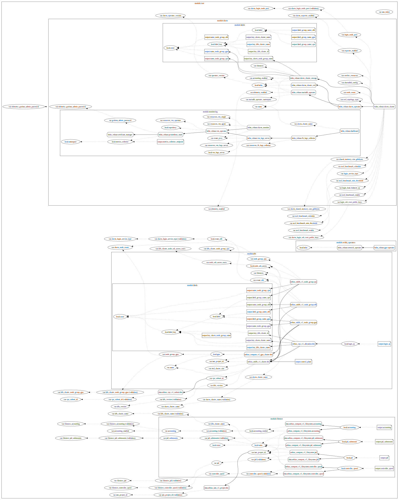

# Terraform operator for Slurm

## Resource dependency graph



### Detailed


## Prerequisites

### Nebius CLI

Install and initialize [Nebius CLI](https://docs.nebius.ai/cli/install).

### Keeping state in Storage

In order to store Terraform state remotely in Nebius Object Storage, Terraform must be able to connect to it.
We'll use [service account](https://docs.nebius.ai/iam/service-accounts/manage/) for that purpose.

Let's start with exporting your tenant and project IDs for a further use.

> [!TIP]
> We suggest you to replace checks for `NEBIUS_TENANT_ID` and `NEBIUS_PROJECT_ID` in provided [`.envrc`](installations/example/.envrc) file
> with the following:
> 
> ```bash
> # --------------------
> # Automatic retrieving
> # --------------------
> NEBIUS_TENANT_ID=$(nebius iam tenant list \
>   --format json \
>   | jq -r ".items.[0].metadata.id")
> export NEBIUS_TENANT_ID
> 
> NEBIUS_PROJECT_ID=$(nebius iam project list \
>   --parent-id "${NEBIUS_TENANT_ID}" \
>   --format json \
>   | jq -r ".items.[0].metadata.id")
> export NEBIUS_PROJECT_ID
> 
> # ---------------
> # OR specific IDs
> # ---------------
> export NEBIUS_TENANT_ID='<YOUR TENANT ID>'
> export NEBIUS_PROJECT_ID='<YOUR PROJECT ID>'
> ```

#### Service account

1. Create service account

   ```bash
   NEBIUS_SA_TERRAFORM_ID=$(nebius iam service-account create \
      --parent-id "${NEBIUS_PROJECT_ID}" \
      --name 'slurm-terraform-sa' \
      --format json | jq -r '.metadata.id')
   export NEBIUS_SA_TERRAFORM_ID
   ```

2. Add this account to the `editors` group

   ```bash
   # Getting ID of the 'editors' group
   NEBIUS_GROUP_EDITORS_ID=$(nebius iam group get-by-name \
      --parent-id "${NEBIUS_TENANT_ID}" \
      --name 'editors' \
      --format json | jq -r '.metadata.id')
   export NEBIUS_GROUP_EDITORS_ID
   
   # Adding SA to the 'editors' group
   nebius iam group-membership create \
      --parent-id "${NEBIUS_GROUP_EDITORS_ID}" \
      --member-id "${NEBIUS_SA_TERRAFORM_ID}"
   ```

3. Create a key pair for giving AWS CLI a way to access Storage with the service account

   ```bash
   NEBIUS_SA_ACCESS_KEY_ID=$(nebius iam access-key create \
      --parent-id "${NEBIUS_PROJECT_ID}" \
      --name 'slurm-terraform-sa-access-key' \
      --account-service-account-id "${NEBIUS_SA_TERRAFORM_ID}" \
      --description 'AWS CLI key' \
      --format json | jq -r '.resource_id')
   export NEBIUS_SA_ACCESS_KEY_ID
   ```

#### AWS CLI

1. [Install](https://docs.aws.amazon.com/cli/latest/userguide/getting-started-install.html) `aws`
2. Add the key, the Nebius AI region ID and the Object Storage endpoint URL to the AWS CLI configuration

   ```bash
   aws configure set aws_access_key_id "${NEBIUS_SA_ACCESS_KEY_AWS_ID}"
   aws configure set aws_secret_access_key "${NEBIUS_SA_SECRET_ACCESS_KEY}"
   aws configure set region 'eu-north1'
   aws configure set endpoint_url 'https://storage.eu-north1.nebius.cloud:443'
   ```

#### Bucket

```bash
NEBIUS_BUCKET_NAME="tfstate-slurm-k8s-$(echo -n "${NEBIUS_TENANT_ID}-${NEBIUS_PROJECT_ID}" | md5sum | awk '$0=$1')"
nebius storage bucket create --parent-id "${NEBIUS_PROJECT_ID}" --versioning-policy 'enabled' --name "${NEBIUS_BUCKET_NAME}"
```

> [!NOTE]
> `NEBIUS_BUCKET_NAME` contains unique bucket name dedicated to the project inside your tenant. 

> [!NOTE]
> `--versioning-policy 'enabled'` allows you to keep track of versions made by Terraform.
> It gives you a possibility to roll back to specified version of TF state in case your installation is broken.

### Environment

You have to have IAM token for auth with **Nebius CLI** and **Nebius Terraform provider**.

In order to do that, we provide `.envrc` file that gets access token from Nebius IAM.
It exposes following environment variables:
- `NEBIUS_IAM_TOKEN` for `nebius` tool
- `TF_VAR_iam_token` for being used in Terraform

Setting `TF_VAR_iam_token` env var to some value is a way to pass this variable to Terraform from environment.
You can also set it within `terraform.tfvars`, but it's not secure, and we do not recommend to do that.

To load variables from `.envrc` file, you can use `direnv` or you can simply call

Install md5sum 

```bash
brew install coreutils
```

```bash
source .envrc
```

> [!TIP]
> If you have your access token expired, you can simply re-source `.envrc`
> ```bash
> source .envrc
> ```

#### `direnv`

`direnv` is a tool for automatic loading of directory-scoped environment variables.
It can find and load variables from e.g. `.envrc` file.

1. [Install](https://direnv.net/#basic-installation) `direnv`
2. Run

   ```bash
   direnv allow .
   ```

    To allow `direnv` access for `.envrc` file.
3. Check if it works

   ```bash
   token_present() { test ${NEBIUS_IAM_TOKEN} && echo 'IAM token is present' || echo 'There is no IAM token'; }
   pushd .. > /dev/null ; echo ; token_present ; echo ; popd > /dev/null ; echo ; token_present
   ```

   You'll get something like:

   ```
   direnv: unloading
   
   There is no IAM token
   
   direnv: loading <PATH>/terraform/.envrc
   direnv: export +NEBIUS_IAM_TOKEN <OTHER ENV VARS>
   
   IAM token is present
   ```

> [!TIP]
> If you have your access token expired, you can switch directories back and forth to trigger unloading/loading of
> `.envrc` file, or just simply call `direnv reload`
> ```bash
> pushd .. && popd
> # or
> direnv reload
> ```

### Terraform CLI

Install [Terraform CLI](https://developer.hashicorp.com/terraform/install).

#### Initialization

Run `terraform init` from [installations/example](./installations/example) directory.

```shell
cd installations/example
terraform init
```

## Create your cluster

We provide default variables in [`terraform.tfvars`](installations/example/terraform.tfvars) file that you can use as a reference for your
cluster configuration.

1. Change some values according to your needs and cloud environment.
2. Run `terraform plan` to make sure if provided values create resources as you want.
3. Run `terraform apply` to create resources based on provided values. You will be prompted to check if resources
correspond to your needs. Type `yes` if the configuration is correct and watch the process.

> [!IMPORTANT]
> If you encounter errors like:
> ```
> Error: failed to install <*>: customresourcedefinitions.apiextensions.k8s.io is forbidden: User "<USER>" cannot create resource "customresourcedefinitions" in API group "apiextensions.k8s.io" at the cluster scope
> ```
> Try to re-run `terraform apply` until they're gone.

Once resource creation is done, you will be able to connect to Slurm login node via SSH using provided public key as a
`root` user.

```shell
SLURM_IP='<NLB node / allocated IP address>'
ssh -i '<Path to provided public key>' [-p <Node port>] root@${SLURM_IP}
```
